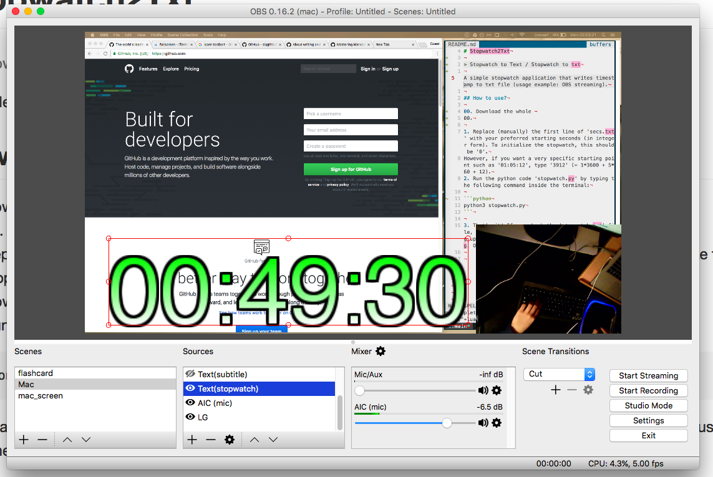

# Stopwatch2Txt
> **Keywords:**  
> stopwatch to text   
> stopwatch to txt  
> for streaming  
> stopwatch output text file  

A simple stopwatch application that writes timestamp to txt file (usage example: OBS streaming).

- It requires Python3  
(but, imo, it would be simple to make this work with Python2, if you can modify the script a tiny bit.  
e.g. `print('Hello') -> print 'hello'` 
- It works for macOS.  
I did not test for linux environment yet but I guess it would work. Please let me know through issue tracker.


This is an example of using Stopwatch2Txt. (OBS text capture : 'Read text from file' linked to '~/Stopwatch2Txt/stopwatch.txt')

## How to use?

00. Download the whole repository using `git clone https://github.com/dqgthb/Stopwatch2Txt.git`
00. Go inside the directory. Find 'secs.txt'.
1. Replace (manually) the first line of 'secs.txt' with your preferred starting seconds (in integer). To initialize the stopwatch, this should be '0'.  
However, if you want a very specific starting point such as '01:05:12', type '3912' (= 1 \* 3600 + 5 \* 60 + 12).
2. Run the python code 'stopwatch.py' by typing the following command inside the terminal:

    ```python
    python3 stopwatch.py
    ```

00. If you want to pause the stopwatch, press "Ctrl c".
00. If you want to resume the stopwatch, type `python3 stopwatch.py` again in the terminal.
00. If you want to reset the stopwatch, press "Ctrl c" and replace the first line of 'secs.txt' to 0. (as already explained above).
3. That's it! If you check the 'stopwatch.txt' file, you will see that the file is constantly being updated. You can use this wherever you want. e.g. OBS text source


